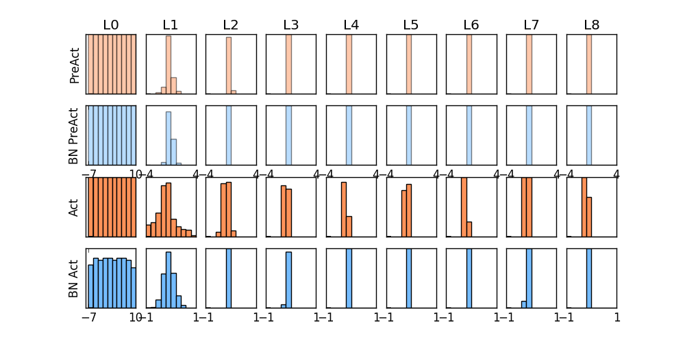

# This is an on-going building model for the tutorials of object detection with my slides and codings.

* Tutorial 1
  * Quantilization
  * Image Deformation
  * Convolution

* Tutorial 2
  * Hog
  * SIFT
  * Image Match

* Tutorial 3
  * Hough Transformation
  * Lucas-Kanade track
  * KNN Mnist

* Tutorial 4
  * NN_Classification from scratch

* Tutorial 5
  * Tf Mnist with batch Normalization

* Tutorial 6
  * Tensor visualization and parameter optimization

* Tutorial 7
  * nn mnist from scratch
  * Tf CIFAR 10

## Image Match

## Hough Transform

## Visualization

## tf-Batch Norm

## tf-MNIST

## tf-CIFAR-10

